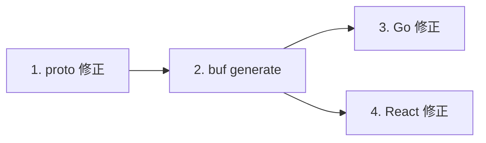

# 🚀 Go + React Connect RPC ナレッジベース & 開発ガイド

このドキュメントは、バックエンドに **Go**、フロントエンドに **React (TypeScript + Vite)** を採用し、両者を **Connect RPC** で連携させるフルスタック開発のナレッジ、従来の REST API との比較、Proto の書き方、ビジネスロジックの実装箇所、型変更時の対応手順をまとめた完全ガイドです。

---

## 1. 💡 Connect RPC とは？

**Connect RPC** は、Protocol Buffers (`.proto`) をスキーマ定義の単一情報源（Single Source of Truth）とし、HTTP/1.1 および HTTP/2 上で動作するシンプルで型安全な RPC フレームワークです。

- **ブラウザ直結**: 従来の gRPC で必要だった Envoy などのリバースプロキシ（gRPC-Web プロキシ）が不要。Go サーバーと React が直接 HTTP で通信可能。
- **完全な型安全**: スキーマから Go と TypeScript の両方のコード・型定義を自動生成。
- **マルチプロトコル対応**: Connect プロトコル、gRPC、gRPC-Web のすべてを同一ポートで自動サポート。

---

## 2. ⚖️ 従来の REST API との比較・メリット

### ① 比較サマリー

| 比較項目 | 従来の REST API (`/rest`) | Connect RPC (`/rpc`) |
| :--- | :--- | :--- |
| **仕様書 / スキーマ** | OpenAPI (Swagger) を手動記述（コードとズレやすい） | `.proto` ファイルが唯一絶対の仕様書 |
| **型の二重管理** | Go の `struct` と TS の `interface` を別々に手書き | `buf generate` で Go/TS の型・関数が**完全自動生成** |
| **通信処理コード** | URL, HTTPメソッド, Headers, `JSON.stringify`, `res.json()` を手動記述 | 通常のローカル関数を呼ぶ感覚（`client.estimate(req)`） |
| **IDE 補完 (DX)** | 手動型定義頼み。バックエンド変更時は無反応 | **完全なオートコンプリート**。変更時は即座に型エラー検知 |
| **変更の検知タイミング** | **実行時**（ブラウザで動かして `undefined` やバグで発覚） | **コンパイル時 / ビルド時**（CI やエディタで即検知） |
| **通信効率** | テキスト JSON | JSON または Protobuf (バイナリ通信による高速化) |

### ② なぜ Connect RPC が圧倒的に「楽」なのか？（4大メリット）

1. **型定義の手動作成・同期コストが「ゼロ」になる**
   - REST では、バックエンドでフィールドを 1 つ追加・変更するたびに、Go の構造体、OpenAPI 仕様書、フロントエンドの TypeScript 型定義の 3 箇所を手動で修正する必要がありました。
   - Connect RPC では、`.proto` を 1 行書き換えて `buf generate` するだけで、バックエンドとフロントエンドの両方の型定義とクライアントコードが一瞬で最新化されます。

2. **通信周りのボイラープレート（定型文）の全廃**
   - URL パスの指定、HTTP メソッド（GET/POST）の選択、JSON のシリアライズ/デシリアライズ、ヘッダー設定、ステータスコードのハンドリングなど、人間が書く必要のない定型コードを完全に排除できます。

3. **リファクタリングが絶対に壊れない（コンパイル時エラー検知）**
   - フィールド名を変更した場合、TypeScript の型チェッカーと Go のコンパイラが「どこを直すべきか」を 100% 正確に指摘してくれます。

4. **複数パラメータ・ネスト配列でも破綻しない**
   - 複雑なリクエスト（注文アイテムの配列やクーポン、会員フラグなど）を扱う場合でも、型のズレやキャメルケース/スネークケースの不整合によるバグが原理的に起きません。

---

## 3. 📝 Protocol Buffers (`.proto`) の書き方と型出力の仕組み

通信の「設計図」となる `.proto` ファイルを `proto/` ディレクトリ配下に記述します。

### ① `.proto` の書き方

```proto
syntax = "proto3";

package greet.v1;

// Go コード生成時のパッケージパス
option go_package = "my-rpc-app/gen/greet/v1;greetv1";

// 1. メッセージ (データ構造) の定義
message OrderItem {
  string item_name = 1; // フィールド名 = フィールド番号
  int32 unit_price = 2;
  int32 quantity = 3;
}

message OrderEstimateRequest {
  string customer_name = 1;
  repeated OrderItem items = 2; // repeated は配列 (List / Array)
  string coupon_code = 3;
  bool is_member = 4;           // 真偽値
}

message OrderEstimateResponse {
  string estimate_id = 1;
  int32 subtotal = 2;
  int32 discount_amount = 3;
  int32 total_amount = 4;
  repeated string applied_discounts = 5;
}

// 2. サービス (API エンドポイント群) の定義
service OrderEstimateService {
  // rpc メソッド名(リクエスト型) returns (レスポンス型);
  rpc Estimate(OrderEstimateRequest) returns (OrderEstimateResponse);
}
```

#### 基本型の対応表
| Protobuf 型 | Go 型 | TypeScript 型 | 備考 |
| :--- | :--- | :--- | :--- |
| `string` | `string` | `string` | 文字列 |
| `int32` / `int64` | `int32` / `int64` | `number` / `bigint` | 整数 |
| `double` / `float` | `float64` / `float32`| `number` | 浮動小数点数 |
| `bool` | `bool` | `boolean` | 真偽値 |
| `repeated T` | `[]T` (スライス) | `T[]` (配列) | リスト・配列 |
| `Message` | `*Struct` (ポインタ) | `Object` | ネストされたオブジェクト |

---

### ② 型を吐き出す設定 (`buf.gen.yaml`)

プロジェクトルートの `buf.gen.yaml` で、どこにどの言語のコードを出力するかを指定します。

```yaml
version: v2
plugins:
  # Go サーバー用コード生成 -> backend/gen
  - remote: buf.build/protocolbuffers/go
    out: backend/gen
    opt: paths=source_relative
  - remote: buf.build/connectrpc/go
    out: backend/gen
    opt: paths=source_relative

  # TypeScript クライアント用コード生成 -> frontend/src/gen
  - remote: buf.build/bufbuild/es
    out: frontend/src/gen
    opt: target=ts
  - remote: buf.build/connectrpc/es
    out: frontend/src/gen
    opt: target=ts
```

### ③ コマンド一発で型を出力
```bash
buf generate
```
これを実行すると、以下の自動生成ファイルが生成・更新されます（**※ これらの自動生成ファイルは手動編集しません**）：
- `backend/gen/greet/v1/greet.pb.go` （Go 構造体・シリアライザ）
- `backend/gen/greet/v1/greetv1connect/greet.connect.go` （Go サーバーインターフェース）
- `frontend/src/gen/greet/v1/greet_pb.ts` （TypeScript 型・スキーマ）
- `frontend/src/gen/greet/v1/greet_connect.ts` （TypeScript クライアント定義）

---

## 4. 💼 開発者が書く「ビジネスロジック」の場所と実装方法

型や通信基盤が自動生成された後、開発者が実際に記述するのは**「純粋なビジネスロジック」だけ**です。

```
[自動生成ファイル (編集不可)]
  - backend/gen/...
  - frontend/src/gen/...
         ⬇ 型とインターフェースを提供
[開発者が書く場所 (ビジネスロジック)]
  - backend/main.go (ロジック実装)
  - frontend/src/pages/RpcPage.tsx (UI & 呼び出し)
```

### ① Go バックエンドで書く場所: `backend/main.go`

Go 側では、自動生成されたインターフェースを満たすメソッドを実装するだけです。
HTTP メソッドチェック、JSON パース、ヘッダー設定、エラー処理などのボイラープレートは**一切不要**です。

```go
// backend/main.go

// 1. サーバー構造体を定義
type OrderEstimateServer struct{}

// 2. 自動生成されたインターフェースのメソッドを実装 (ここにビジネスロジックだけを書く！)
func (s *OrderEstimateServer) Estimate(
	ctx context.Context,
	req *connect.Request[greetv1.OrderEstimateRequest],
) (*connect.Response[greetv1.OrderEstimateResponse], error) {

	// ★ リクエストデータは型安全に req.Msg に格納されている
	msg := req.Msg

	// --- [ビジネスロジック開始] ---
	var subtotal int32 = 0
	for _, item := range msg.Items {
		subtotal += item.UnitPrice * item.Quantity
	}

	var discountAmount int32 = 0
	var appliedDiscounts []string

	if msg.IsMember && subtotal > 0 {
		memberDiscount := subtotal * 5 / 100
		discountAmount += memberDiscount
		appliedDiscounts = append(appliedDiscounts, fmt.Sprintf("会員特別割引 (5%%): -¥%d", memberDiscount))
	}
	// --- [ビジネスロジック終了] ---

	// ★ レスポンス構造体を返せば、自動的に JSON/Protobuf シリアライズと HTTP 返却が行われる
	return connect.NewResponse(&greetv1.OrderEstimateResponse{
		EstimateId:       "EST-88231",
		Subtotal:         subtotal,
		DiscountAmount:   discountAmount,
		TotalAmount:      subtotal - discountAmount,
		AppliedDiscounts: appliedDiscounts,
	}), nil
}

// 3. ルーターにマウント
func main() {
	mux := http.NewServeMux()
	path, handler := greetv1connect.NewOrderEstimateServiceHandler(&OrderEstimateServer{})
	mux.Handle(path, handler)
	// ... サーバー起動
}
```

---

### ② React フロントエンドで書く場所: `frontend/src/pages/RpcPage.tsx`

フロントエンド側では、`fetch` や URL、HTTP メソッドの指定は不要です。自動生成されたクライアントを使って**ローカルの関数を呼ぶように**呼び出します。

```tsx
// frontend/src/pages/RpcPage.tsx
import { createClient } from '@connectrpc/connect'
import { createConnectTransport } from '@connectrpc/connect-web'
import { OrderEstimateService } from '../gen/greet/v1/greet_pb'

// 1. クライアントの作成 (接続先ベースURLを指定するだけ)
const transport = createConnectTransport({ baseUrl: 'http://localhost:8080' })
const estimateClient = createClient(OrderEstimateService, transport)

export function RpcPage() {
  const handleEstimate = async () => {
    // 2. 普通の TypeScript 関数として呼び出し (IDE で引数・プロパティが全自動補完！)
    const res = await estimateClient.estimate({
      customerName: "田中太郎",
      couponCode: "SAVE10",
      isMember: true,
      items: [
        { itemName: "ノートPC", unitPrice: 120000, quantity: 1 }
      ],
    })

    // 3. 戻り値も完全型安全 (res.totalAmount, res.appliedDiscounts など)
    console.log("見積ID:", res.estimateId)
    console.log("最終合計額:", res.totalAmount)
  }

  return <button onClick={handleEstimate}>見積もりを計算</button>
}
```

---

## 5. 🔄 型（スキーマ）が変わる場合の変更対応フロー

API の仕様変更（パラメータ追加、名前変更、型変更など）を行う場合は、以下の **4 ステップ** で安全に作業が完了します。



### ステップ 1: `proto/` のスキーマを修正
例: `OrderEstimateRequest` に郵便番号 `string postal_code = 5;` を追加したい場合。
```proto
message OrderEstimateRequest {
  string customer_name = 1;
  repeated OrderItem items = 2;
  string coupon_code = 3;
  bool is_member = 4;
  string postal_code = 5; // ★ 追加
}
```

### ステップ 2: コード自動生成を実行
```bash
buf generate
```
この時点で、Go 側の構造体（`req.Msg.PostalCode`）と TypeScript の型（`postalCode: string`）が即座に同期されます。

### ステップ 3: Go バックエンドの修正
`backend/main.go` で必要に応じて新しいフィールド `msg.PostalCode` を利用するロジックを追加します。もし既存フィールドを削除・変更した場合は、Go コンパイラがビルドエラーとして修正箇所を教えてくれます。

### ステップ 4: React フロントエンドの修正
`frontend/src/pages/RpcPage.tsx` で、新しいフィールド `postalCode` をフォーム入力やリクエストに追加します。エディタが即座にプロパティを補完し、もし古い存在しないプロパティを指定していれば赤波線（型エラー）で警告してくれます。

> **💡 メリット:**
> REST のように「バックエンドだけ変更してフロントの修正が漏れ、本番デプロイ後に画面が真っ白になる」といった事故が、仕組み上 100% 発生しません。

---

## 6. 📂 ディレクトリ構成

```text
.
├── proto/             # Protocol Buffers (スキーマ定義の単一情報源)
│   └── greet/v1/
│       └── greet.proto
├── backend/           # Go バックエンド
│   ├── gen/           # 自動生成された Go サーバーコード (編集不可)
│   ├── go.mod
│   ├── go.sum
│   └── main.go        # バックエンドのビジネスロジック実装
├── frontend/          # React フロントエンド (TypeScript + Vite)
│   ├── src/
│   │   ├── gen/       # 自動生成された TS クライアントコード (編集不可)
│   │   ├── pages/
│   │   │   ├── RpcPage.tsx   # Connect RPC 版の実装 (/rpc)
│   │   │   └── RestPage.tsx  # REST API (fetch) 版の実装 (/rest)
│   │   ├── App.tsx    # ナビゲーションとルーティング
│   │   └── main.tsx
│   └── package.json
├── buf.yaml           # Buf のモジュール設定
└── buf.gen.yaml       # コード生成プラグイン・出力先設定
```

---

## 7. 🛠️ 開発・動作確認コマンドまとめ

### スキーマ変更時（Go/TS コード自動生成）
```bash
buf generate
```

### バックエンド起動 (Go)
```bash
cd backend
go run main.go
# サーバーが http://localhost:8080 で起動
```

### フロントエンド起動 (React)
```bash
cd frontend
npm run dev
# http://localhost:5173 で起動
```

ブラウザで `http://localhost:5173/` にアクセスし、Connect RPC 版（`/rpc`）と REST API 版（`/rest`）の動作やコードの違いを比較・確認できます。
