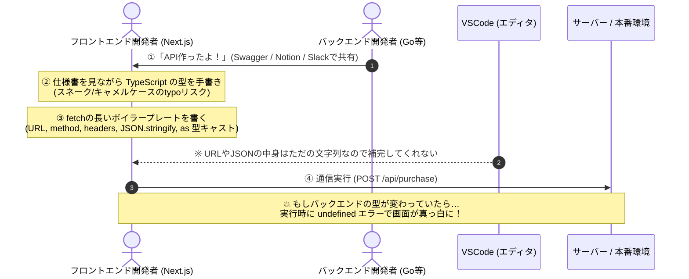
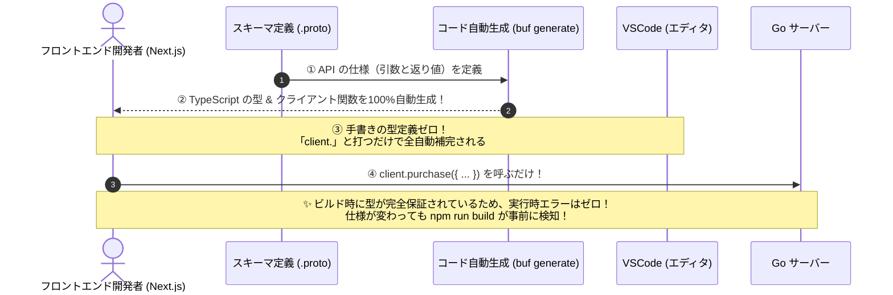

# ⚡ Next.js / React 開発者のための ConnectRPC 入門
## 〜 `fetch` の冗長なコードを捨てて、バックエンドとの型整合性を「自動で」担保する！ 〜

本書は、**「普段 Next.js や React で `fetch()` を使っているフロントエンド開発者」** に向けた ConnectRPC の解説ガイドです。

勉強会や LT（5〜10分）で最も刺さる **「REST と ConnectRPC の処理フロー比較図」** と、ConnectRPC の最大の売りである **「① バックエンドとのめんどい型整合性の自動担保」** & **「② fetch の冗長コードの徹底簡略化（とにかく楽！）」** を前面に押し出した構成になっています。

---

## 📊 【図解比較】REST vs ConnectRPC の処理の流れ

開発から実行までの流れを比べると、ConnectRPC がいかに「人間の手作業」と「バグの温床」を削ぎ落としているかが一目でわかります。

### ❌ 1. 従来の REST API の流れ（手作業が多くてズレやすい）



---

### ⭕️ 2. ConnectRPC の流れ（すべて自動同期・とにかく楽！）



---

## 🔥 ConnectRPC の 2大「売り」ポイント！

### 売り ①：バックエンドとのめんどい「型整合性」を 100% 自動で担保！
フロントとバックで一番めんどくさいのは、**「API仕様のすり合わせと型の同期」** です。

* **REST の現実:**
  * 「Swagger の更新が漏れていて実際のレスポンスと違った…」
  * 「バックエンドは `user_id` なのに、フロントで `userId` と書いていて動かなかった…」
  * 「バックエンドが仕様変更したのに気づかず、本番リリース後に画面真っ白バグが発生した…」
* **ConnectRPC なら:**
  * スキーマ（`.proto`）が **唯一の絶対的な正義（Single Source of Truth）**。
  * コマンド一発で Go と TypeScript の型が完全同期。
  * バックエンド側で仕様変更があった場合、**フロントエンドの `npm run build` がコンパイルエラーを出して即座に教えてくれる** ため、手動確認や Grep 検索の必要がゼロになります。

---

### 売り ②：`fetch` の冗長なコードを全消去！とにかく「楽！！」
URLの文字列、HTTPメソッド、リクエストヘッダー、JSONパース……。毎回書いていた「お決まりの退屈なコード」がすべて消え去ります。

#### 💻 コードの圧倒的シンプル化（比較）

```typescript
// ❌ 従来の REST (Next.js) : 冗長でミスが起きやすい…
type PurchaseResponse = { receiptId: string; totalPrice: number };

async function buyItem() {
  // 1. URLを間違えないように手入力
  // 2. method: "POST" を指定
  // 3. headers を指定
  // 4. JSON.stringify() で文字列化
  const res = await fetch("http://localhost:8080/api/purchase", {
    method: "POST",
    headers: { "Content-Type": "application/json" },
    body: JSON.stringify({ product_id: "prod-apple", quantity: 2 }),
  });

  // 5. ステータスコードをチェック
  if (!res.ok) throw new Error("購入失敗");

  // 6. JSONパース ＋ 「as」で嘘かもしれない型をつける
  const data = (await res.json()) as PurchaseResponse;
  console.log(data.totalPrice);
}
```

```typescript
// ⭕️ ConnectRPC : たったこれだけ！普通の関数を呼ぶ感覚で「楽！！」
async function buyItem() {
  // URLもHTTPメソッドもJSONパースも意識不要！
  // 引数も返り値も VSCode が 100% オートコンプリートしてくれる
  const res = await purchaseClient.purchase({
    productId: "prod-apple",
    quantity: 2,
  });

  console.log(res.totalPrice); // 最初から number 型として保証されている！
}
```

---

## 🎁 おまけ：リアルタイム通信（進捗バー表示など）も数行で書ける！

WebSocket サーバーの構築や、面倒な接続維持・切断処理は一切不要です。  
JavaScript 標準の `for await` ループを書くだけで、Go サーバーからのリアルタイム進捗を受信できます。

```typescript
// 🚀 WebSocket 不要！標準のループ処理だけでリアルタイム受信
const stream = streamingClient.streamProgress({
  taskName: "一括データ処理",
  totalSteps: 5,
});

for await (const chunk of stream) {
  console.log(`進捗率: ${chunk.percentage}% - ${chunk.message}`);
  setProgress(chunk.percentage); // React の useState をそのまま更新！
}
```

---

## 💻 デモアプリを触ってみる

現在ローカルでサーバーが起動しています。ブラウザで画面を開いて体験してみてください！

* **React / Next.js デモ画面:** 👉 [http://localhost:5173](http://localhost:5173)
* **バックエンド (Go):** `http://localhost:8080`

1. **Unary Call (Greet)**: 名前を入力して送信（空文字で送ると型付きエラーの検知を体験）
2. **State & Purchase**: 商品を選択して購入（在庫がリアルタイムに連動）
3. **Live Streaming**: ボタン1つで WebSocket なしのリアルタイム進捗を受信
